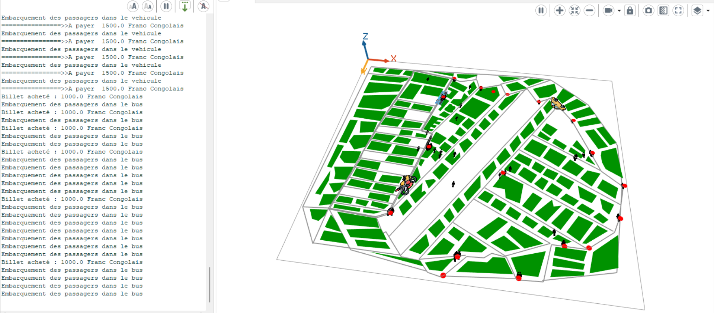
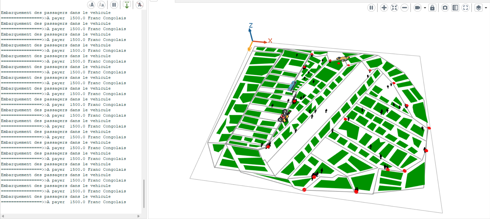
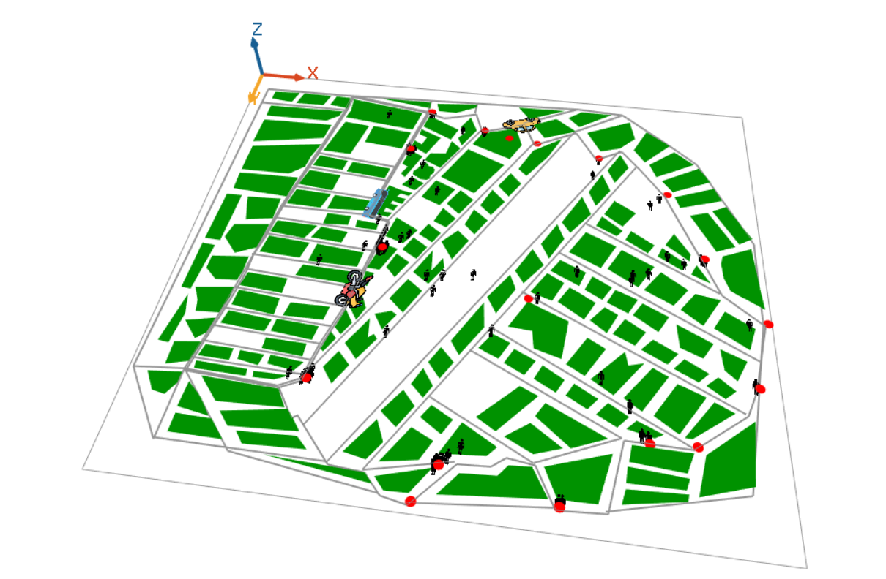
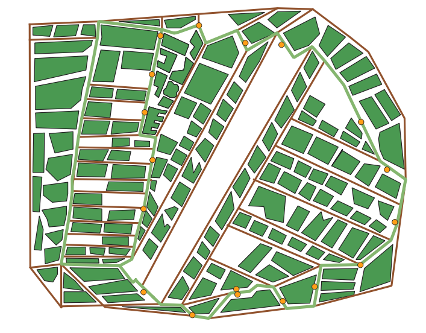

---

# Système de Circulation Urbaine - Simulation Kinshasa

---

## 📖 **Résumé du Projet**

Le **Système de Circulation Urbaine - Simulation Kinshasa** est une simulation qui modélise le déplacement des véhicules (bus, véhicules privés, motos) et des individus dans une ville en utilisant des itinéraires prédéfinis. Le système simule les interactions entre les moyens de transport et les usagers, gérant des états dynamiques tels que le départ, l’arrivée, la gestion des billets et la capacité des véhicules.



---

## 🎯 **Objectifs du Projet**

- **Simulation** : Visualisation réaliste de la circulation et des flux de transport dans une ville.
- **Modélisation des moyens de transport** : Bus, véhicules et motos avec des capacités limitées.
- **Gestion des passagers** : Gestion des montées, des tickets, et des limitations de capacité.
- **Développement basé sur l’interaction** : Simulation de la marche, des déplacements, et des interactions entre les différentes entités.



---

## 🛠 **Technologies Utilisées**

- **Langages** : GAML (pour la logique de simulation).
- **Outils** : GAMA Simulation Platform, Qgis.

---

## 📂 **Structure du Projet**

```plaintext
Système de Circulation Urbaine - Simulation Kinshasa/
├── models                                            # Dossier contenant le Script principal du modèle
│   ├── Systeme-Transport-bus-Hanoi-avec-GAMA.gaml    # Script principal du modèle
├── includes/                                         # Dossier contenant les fichiers annexes
│   ├── route.shp                                     # Fichier des routes
│   ├── batiment.shp                                  # Fichier des bâtiments
│   ├── arret.shp                                     # Fichier des arrêts de bus
│   ├── terminus_a.shp                                # Fichier des terminus
│   ├── ward.shp                                      # Fichier des quartiers
│   ├── line_1.shp                                    # Ligne de bus 1
│   ├── line_2.shp                                    # Ligne de bus 2
│   ├── line_3.shp                                    # Ligne de bus 3
│   └── Personne.png                                  # Image d'icône Personne
│   ├── car.png                                       # Image d'icone Voiture
│   ├── bus.png                                       # Image d'icone Bus
└── README.md                                         # Documentation du projet
```

---

## 💻 **Installation**

### **1. Pré-requis**
- [Télécharger GAMA Platform](https://gama-platform.org/) pour exécuter les simulations.
- Avoir les fichiers `.shp` nécessaires au projet.

### **2. Installation**
1. **Cloner le dépôt** :
   ```bash
   git clone https://github.com/DavidLUTALA/Systeme-de-Circulation-Urbaine-Simulation-Kinshasa.git
   cd Systeme-de-Circulation-Urbaine-Simulation-Kinshasa
   ```
2. Ouvrez GAMA Platform et importez le projet zippé `Systeme-de-Circulation-Urbaine-Simulation-Kinshasa.zip`.

### **3. Exécution**
- Lancez la simulation et observez :  
  - Les bus se déplaçant entre les arrêts.
  - Les interactions entre les différents agents et infrastructures.


---

## 🚀 **Instructions d'Utilisation**

1. **Démarrer la Simulation** :
   - Ouvrir la simulation via GAMA.
   - Choisir le scénario souhaité.
   - Observations des comportements des transports et des individus dans la ville.

2. **Gestion des Usagers** :
   - Voir les interactions entre individus et véhicules.
   - Suivre les mouvements des personnes, l’achat de tickets et les transitions d’état.



---

## 📌 **Fonctionnalités Clés**

- **Simulation 3D** : Visualisation réaliste de la circulation et des interactions entre moyens de transport et personnes.
- **Modèle de transport** :
  - Bus avec capacités limitées et itinéraires définis.
  - Véhicules privés et motos avec systèmes similaires.
- **Gestion des Passagers** : Billetterie, validation, et suivi du nombre de personnes à bord.


---

## 📬 **Auteur**

- **David LUTALA LUSHULI, ISSA SORO Fiti, Olivia Marthe Désirée HABACK, Ibrahima DIALLO**

---


